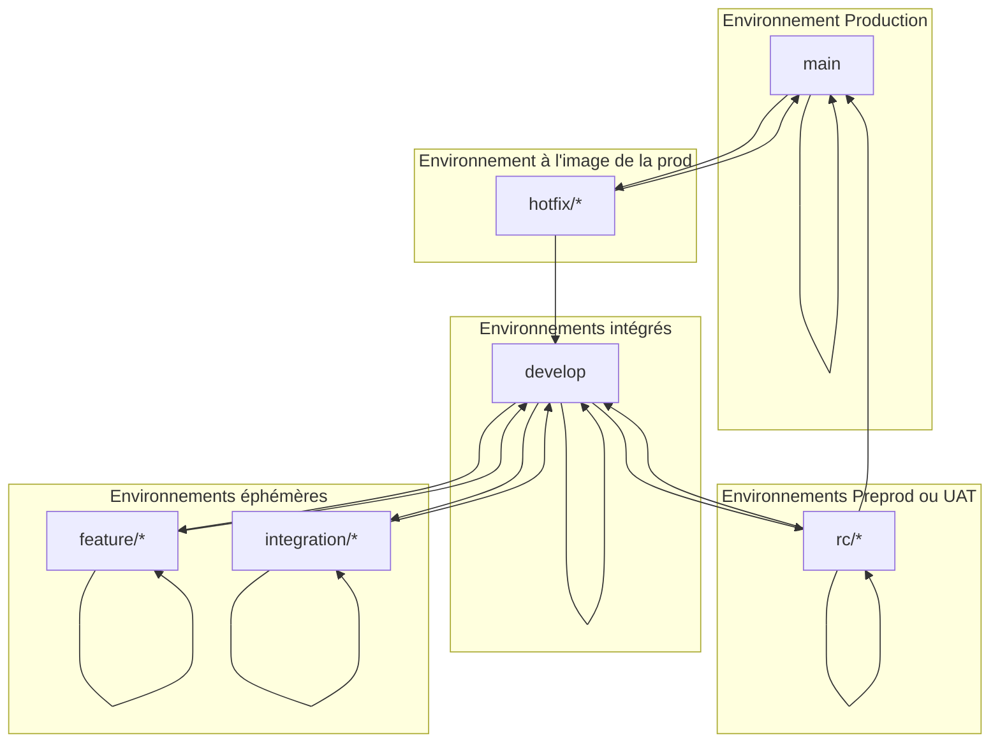

```mermaid
flowchart TD

    %% Nodes
    subgraph PROD["Environnement Production"]
        MAIN[main]
    end

    subgraph HOTFIX["Environnement à l'image de la prod"]
        HOT[hotfix/*]
    end

    subgraph PREPROD["Environnements Preprod ou UAT"]
        RC[rc/*]
    end

    subgraph DEV["Environnements intégrés"]
        DEVELOP[develop]
    end

    subgraph TEMP["Environnements éphémères"]
        FEATURE[feature/*]
        INTEGRATION[integration/*]
    end

    %% Flows
    MAIN --> MAIN
    MAIN --> HOT
    HOT --> MAIN
    HOT --> DEVELOP

    DEVELOP --> DEVELOP
    DEVELOP --> RC
    RC --> RC
    RC --> DEVELOP
    RC --> MAIN

    DEVELOP --> FEATURE
    FEATURE --> FEATURE
    FEATURE --> DEVELOP

    DEVELOP --> INTEGRATION
    INTEGRATION --> INTEGRATION
    INTEGRATION --> DEVELOP
```
